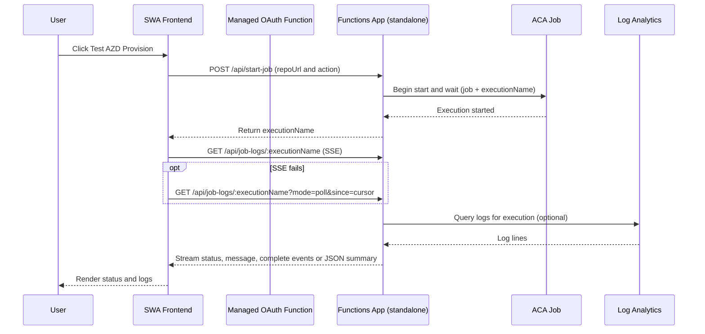
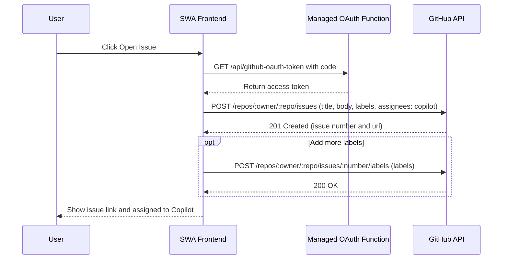

# Template Doctor – Deployment Test Architecture

This diagram shows how the Static Web App (frontend), managed/standalone Functions, Azure Container Apps Job, and Log Analytics interact during the “Test AZD Provision” flow.

Notes
- Frontend attempts SSE first for logs, then falls back to JSON polling automatically.
- The Stop button stops local streaming (not the job itself). A cancellable endpoint can be added later if needed.

## GitHub issue creation flow (assign to Copilot)

This diagram shows how the frontend uses the managed OAuth function to exchange the code for a token and then opens a GitHub issue, applying labels and assigning it to Copilot.

