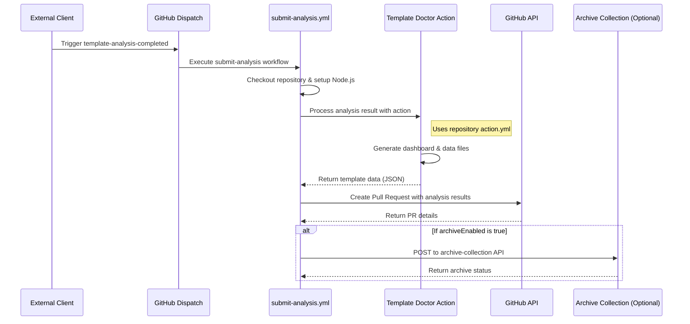
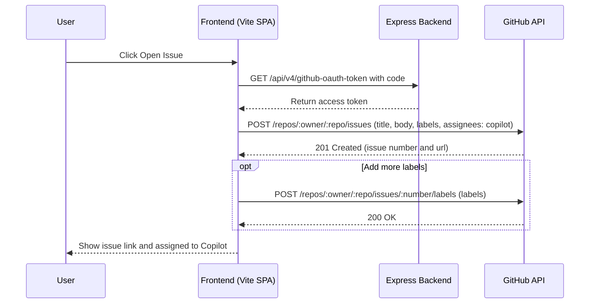

# Template Doctor – Architecture Overview

## Containerized Express Architecture

Template Doctor has migrated from Azure Functions to a containerized Express server architecture. The application now runs as Docker containers, providing better local development experience, easier deployment, and more flexibility in hosting options.

### Components

- **Express Backend** (`packages/server`): TypeScript-based REST API running on port 3001
- **Static Frontend** (`packages/app`): Vite-built SPA running on port 3000 (preview) or 4000 (dev)
- **Docker**: Multi-container (docker-compose) and single-container (Dockerfile.combined) deployment options
- **Legacy Azure Functions**: Preserved in `dev/api-legacy-azure-functions` branch for historical reference

## Template Validation Flow

This diagram shows how the frontend, Express backend, and GitHub workflow interact during the template validation flow, with client-side storage of GitHub run IDs.


Notes:

- The in-memory run-id-store maps internal UUIDs to GitHub workflow run IDs and URLs
- The frontend stores GitHub run IDs in localStorage to maintain mapping across browser sessions
- When polling for status, the frontend includes the stored GitHub run ID in the request
- This provides resilience against Function App restarts, which would otherwise lose the in-memory mapping
- The status endpoint queries the GitHub API with either the client-provided run ID or falls back to in-memory store
- The validation workflow includes additional steps like location determination, repository cloning, and running the microsoft/template-validation-action

## Submit Analysis Workflow

This diagram shows how the Template Doctor processes and submits analysis results to be stored in the repository.



Notes:

- The submit-analysis workflow is triggered by a repository_dispatch event of type "template-analysis-completed"
- The workflow uses the Template Doctor action (action.yml in the repository root) to process analysis results
- The action generates dashboard HTML and data JS files for the analyzed template
- A pull request is created to add these files to the repository
- Optionally, results can be archived to a central collection if configured

## GitHub issue creation flow

This diagram shows how the frontend uses the Express OAuth endpoint to exchange the code for a token and then opens a GitHub issue, applying labels and assigning it to Copilot.



## Overall System Architecture

The following diagram illustrates the high-level containerized system architecture of Template Doctor:

```mermaid
graph TB
    User((User))

    subgraph "Frontend Container (Vite SPA)"
        UI[Web UI]
        ResultsViewer[Results Viewer]
        BatchManager[Batch Manager]
        NotificationSystem[Notification System]
    end

    subgraph "Express Backend Container"
        AnalyzeAPI[/api/v4/analyze]
        ConfigAPI[/api/v4/client-settings]
        AuthAPI[/api/v4/github-oauth-token]
        ValidateAPI[/api/v4/validate-template]
        StatusAPI[/api/v4/validation-status]
        CallbackAPI[/api/v4/validation-callback]
        ArchiveAPI[/api/v4/archive-collection]
    end

    subgraph "Docker Deployment"
        DockerCompose[docker-compose.yml]
        SingleContainer[Dockerfile.combined]
    end

    subgraph "GitHub Workflows"
        ValidationWorkflow[validation-template.yml]
        SubmitAnalysis[submit-analysis.yml]
    end

    subgraph "Storage"
        localStorage[(localStorage)]
        ResultsRepo[(GitHub Pages Results)]
    end

    User --> UI
    UI --> BatchManager
    UI --> NotificationSystem
    UI --> ResultsViewer

    BatchManager --> AnalyzeAPI
    UI --> ValidateAPI
    UI --> StatusAPI
    UI --> AuthAPI
    UI --> ConfigAPI

    AnalyzeAPI --> GitHub
    ValidateAPI --> ValidationWorkflow
    ValidationWorkflow --> CallbackAPI
    CallbackAPI --> StatusAPI

    ValidationWorkflow --> SubmitAnalysis
    SubmitAnalysis --> ResultsRepo
    SubmitAnalysis --> ArchiveAPI

    StatusAPI --> localStorage
    localStorage --> StatusAPI

    ResultsRepo --> ResultsViewer

    AuthAPI --> GitHub

    DockerCompose -.-> UI
    DockerCompose -.-> AnalyzeAPI
    SingleContainer -.-> UI
    SingleContainer -.-> AnalyzeAPI

    class UI,BatchManager,ResultsViewer,NotificationSystem highlight
    class AnalyzeAPI,ConfigAPI,AuthAPI,ValidateAPI,StatusAPI,CallbackAPI,ArchiveAPI highlight
    class ValidationWorkflow,SubmitAnalysis highlight

    classDef highlight fill:#f9f,stroke:#333,stroke-width:2px
```

## Deployment Options

### Local Development

**Two-Terminal Approach (Recommended):**

Terminal 1 - Express Backend:

```bash
cd packages/server
npm run dev  # Runs on port 3001
```

Terminal 2 - Vite Frontend:

```bash
cd packages/app
npm run dev  # Runs on port 4000
```

**Production Preview:**

```bash
cd packages/app
npm run preview  # Runs on port 3000
```

### Docker Deployment

**Multi-Container (Development):**

```bash
docker-compose up
```

- Frontend: http://localhost:3000
- Backend: http://localhost:3001

**Single Container (Production):**

```bash
docker build -f Dockerfile.combined -t template-doctor .
docker run -p 80:80 template-doctor
```

- All services: http://localhost

### Port Allocation

| Service                  | Development | Preview | Docker (Multi) | Docker (Single) |
| ------------------------ | ----------- | ------- | -------------- | --------------- |
| Vite Dev Server          | 4000        | -       | -              | -               |
| Vite Preview             | -           | 3000    | 3000           | -               |
| Express Backend          | 3001        | 3001    | 3001           | -               |
| Nginx (Combined)         | -           | -       | -              | 80              |
| Azure Functions (Legacy) | 7071        | 7071    | -              | -               |

## Migration Status

### Completed Migrations

✅ **Core API Endpoints:**

- `/api/v4/analyze` - Template analysis with fork-first SAML strategy
- `/api/v4/github-oauth-token` - OAuth token exchange
- `/api/v4/client-settings` - Runtime configuration

✅ **Infrastructure:**

- Docker Compose configuration for multi-container deployment
- Combined Dockerfile for single-container production deployment
- Environment variable consolidation
- CORS and security configuration

### Pending Migrations (17 Functions)

The following Azure Functions remain to be migrated to Express endpoints:

**Validation Workflow:**

- `validate-template` → `/api/v4/validate-template`
- `validation-status` → `/api/v4/validation-status`
- `validation-callback` → `/api/v4/validation-callback`
- `validation-cancel` → `/api/v4/validation-cancel`
- `validation-docker-image` → `/api/v4/validation-docker-image`
- `validation-ossf` → `/api/v4/validation-ossf`

**GitHub Actions:**

- `action-trigger` → `/api/v4/action-trigger`
- `action-run-status` → `/api/v4/action-run-status`
- `action-run-artifacts` → `/api/v4/action-run-artifacts`

**Analysis & Submission:**

- `submit-analysis-dispatch` → `/api/v4/submit-analysis-dispatch`
- `add-template-pr` → `/api/v4/add-template-pr`
- `archive-collection` → `/api/v4/archive-collection` ✅ (migrated)

**Repository Management:**

- `repo-fork` → `/api/v4/repo-fork`
- `batch-scan-start` → `/api/v4/batch-scan-start`

**Issue Management:**

- `issue-create` → `/api/v4/issue-create`
- `issue-ai-proxy` → `/api/v4/issue-ai-proxy`

**Setup:**

- `setup` → `/api/v4/setup`

### Legacy Branch

Azure Functions code is maintained in the `dev/api-legacy-azure-functions` branch for historical reference.

```

```
