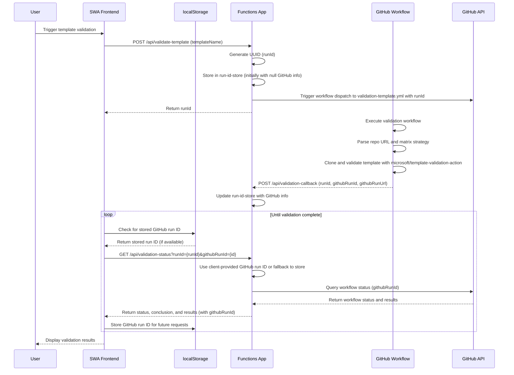
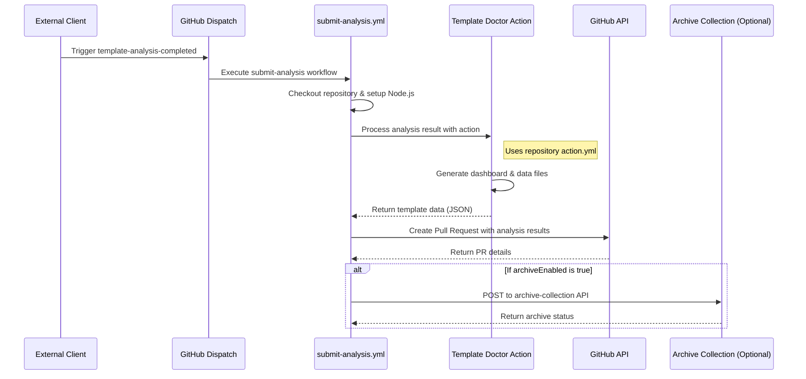
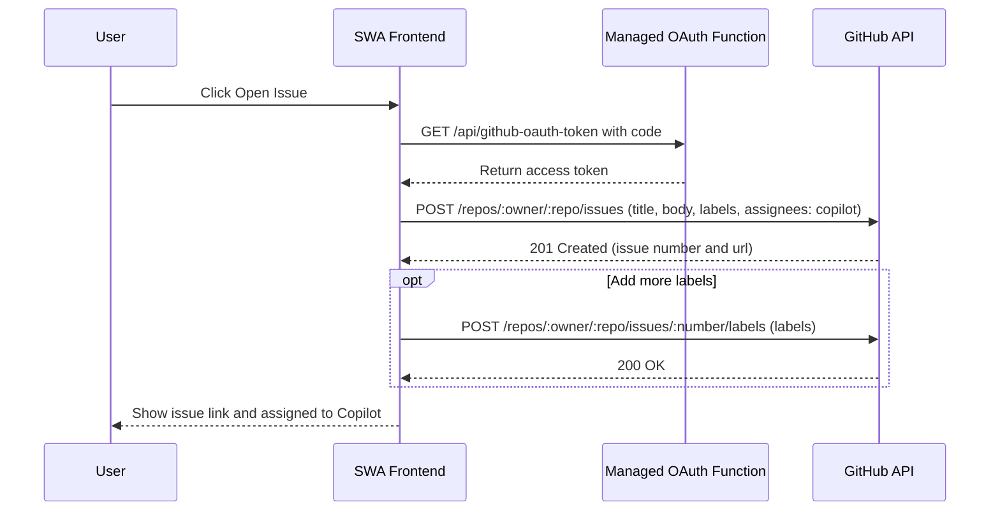
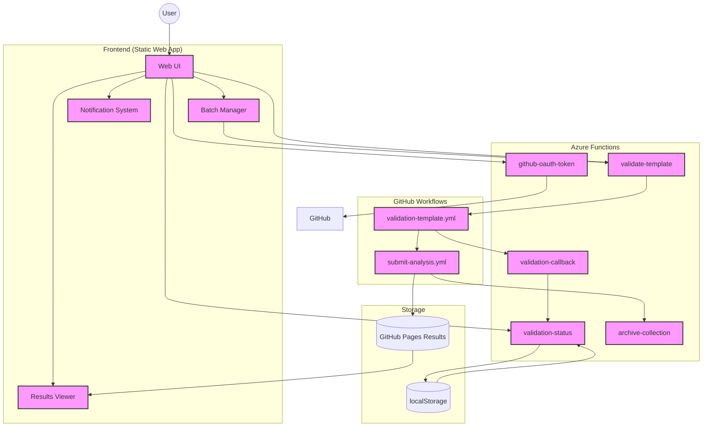

# Template Doctor – Architecture Overview

## Template Validation Flow

This diagram shows how the Static Web App (frontend), Functions App, and GitHub workflow interact during the template validation flow, with client-side storage of GitHub run IDs.

Notes:
- The in-memory run-id-store maps internal UUIDs to GitHub workflow run IDs and URLs
- The frontend stores GitHub run IDs in localStorage to maintain mapping across browser sessions
- When polling for status, the frontend includes the stored GitHub run ID in the request
- This provides resilience against Function App restarts, which would otherwise lose the in-memory mapping
- The status endpoint queries the GitHub API with either the client-provided run ID or falls back to in-memory store
- The validation workflow includes additional steps like location determination, repository cloning, and running the microsoft/template-validation-action

## Submit Analysis Workflow

This diagram shows how the Template Doctor processes and submits analysis results to be stored in the repository.

Notes:
- The submit-analysis workflow is triggered by a repository_dispatch event of type "template-analysis-completed"
- The workflow uses the Template Doctor action (action.yml in the repository root) to process analysis results
- The action generates dashboard HTML and data JS files for the analyzed template
- A pull request is created to add these files to the repository
- Optionally, results can be archived to a central collection if configured

## GitHub issue creation flow

This diagram shows how the frontend uses the managed OAuth function to exchange the code for a token and then opens a GitHub issue, applying labels and assigning it to Copilot.

## Overall System Architecture

The following diagram illustrates the high-level system architecture of Template Doctor:

