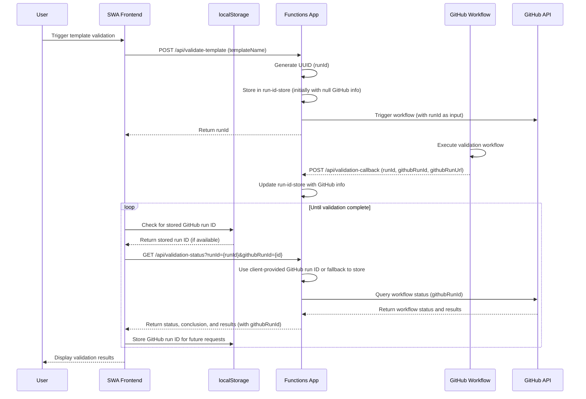
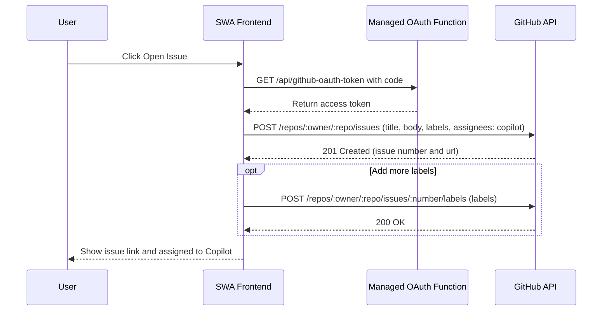

# Template Doctor – Template Validation Architecture

This diagram shows how the Static Web App (frontend), Functions App, and GitHub workflow interact during the template validation flow, with client-side storage of GitHub run IDs.

Notes:
- The in-memory run-id-store maps internal UUIDs to GitHub workflow run IDs and URLs
- The frontend stores GitHub run IDs in localStorage to maintain mapping across browser sessions
- When polling for status, the frontend includes the stored GitHub run ID in the request
- This provides resilience against Function App restarts, which would otherwise lose the in-memory mapping
- The status endpoint queries the GitHub API with either the client-provided run ID or falls back to in-memory store

## GitHub issue creation flow (assign to Copilot)

This diagram shows how the frontend uses the managed OAuth function to exchange the code for a token and then opens a GitHub issue, applying labels and assigning it to Copilot.

