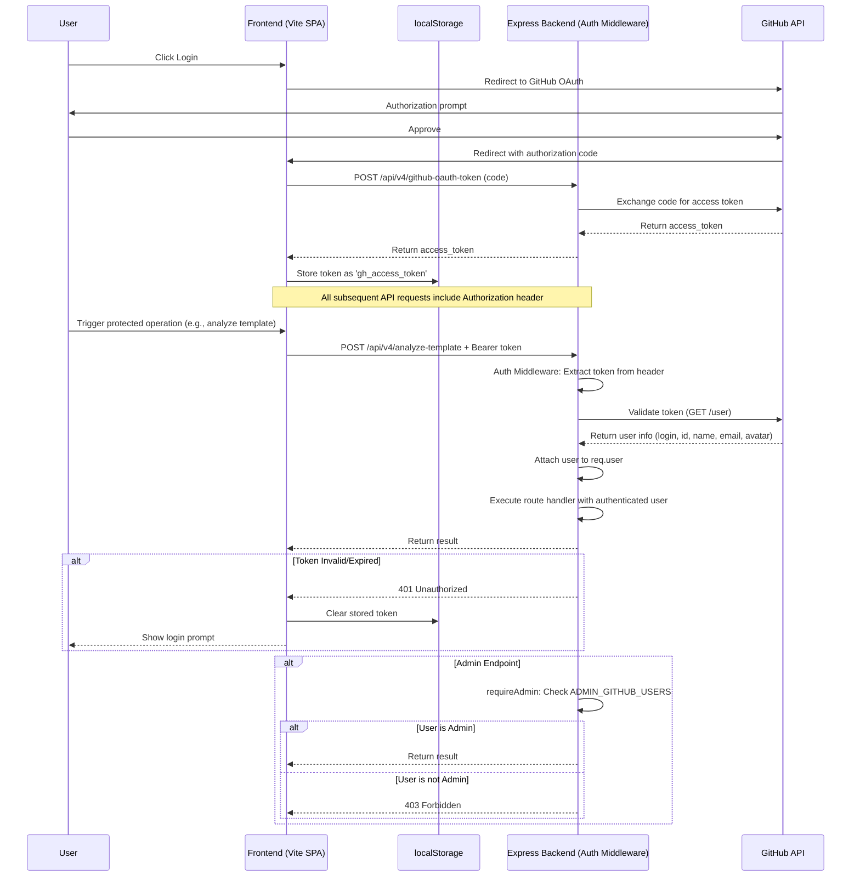
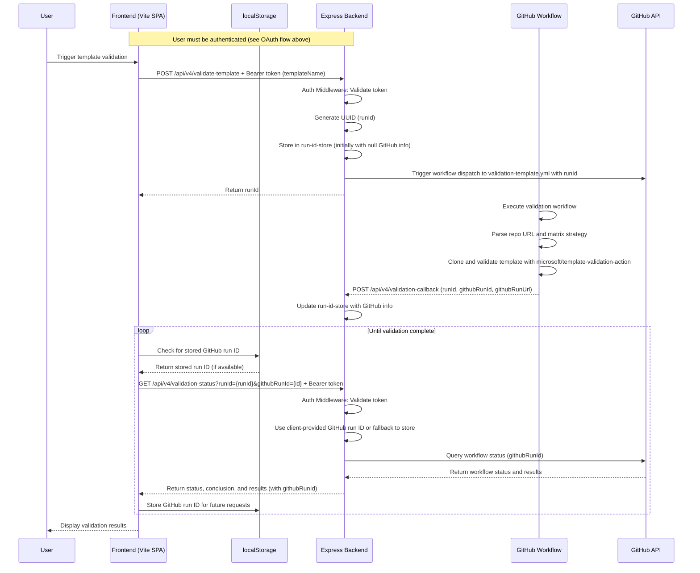
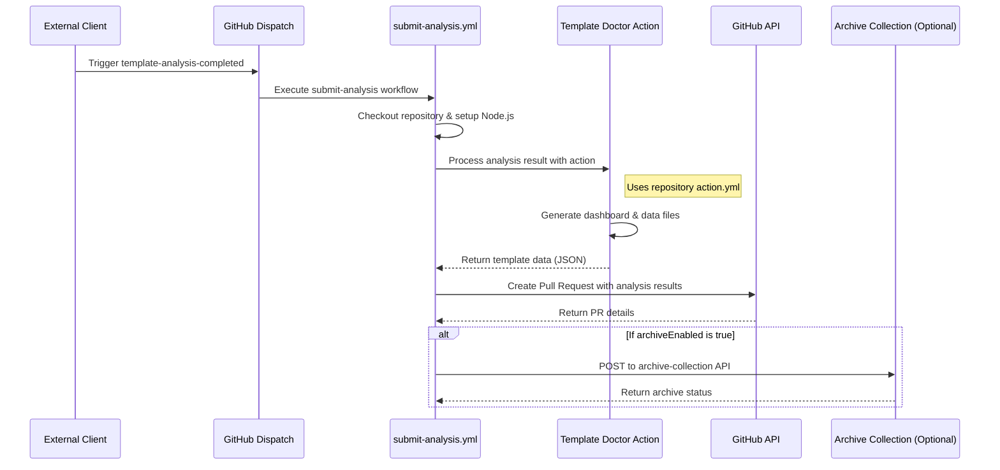
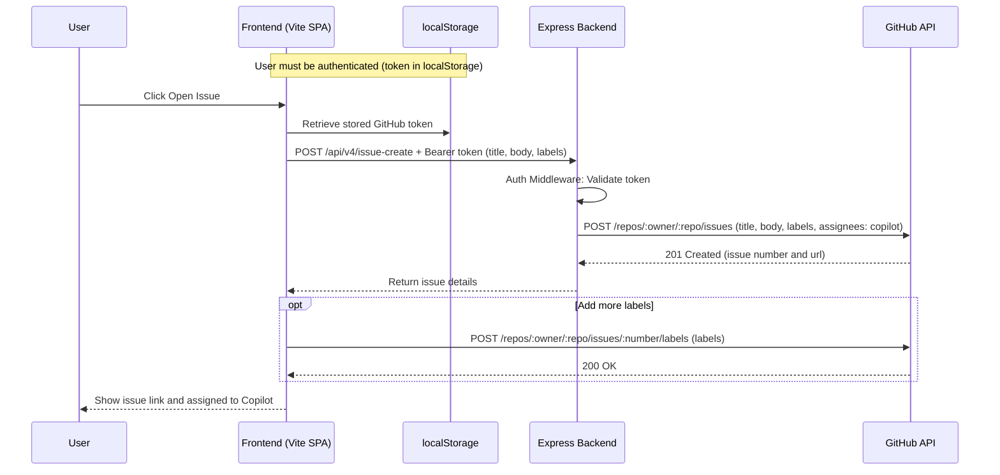

# Template Doctor – Architecture Overview

## Containerized Express Architecture

Template Doctor runs as a containerized Express application with a Vite-built frontend, providing excellent local development experience and flexible deployment options.

### Components

- **Express Backend** (`packages/server`): TypeScript REST API on port 3000
- **Vite Frontend** (`packages/app`): TypeScript SPA (dev: port 4000, production: served by Express)
- **MongoDB/Cosmos DB**: Persistent storage for analysis results and configuration
- **Docker**: Single and multi-container deployment options

## OAuth 2.0 Authentication Flow

Template Doctor uses OAuth 2.0 with GitHub for API authentication. The frontend handles the OAuth flow automatically, and all protected endpoints validate GitHub tokens on every request.



**Endpoint Protection:**

- **Public Endpoints**: No authentication required
  - `/api/health` - Health check
  - `/api/v4/client-settings` - Runtime configuration
  - `/api/v4/github-oauth-token` - OAuth token exchange

- **Protected Endpoints**: Require valid GitHub token
  - `/api/v4/analyze-template` - Template analysis
  - `/api/v4/validate-template` - Trigger validation
  - `/api/v4/validation-*` - All validation endpoints
  - `/api/v4/issue-create` - Create GitHub issue
  - `/api/v4/action-*` - GitHub Actions endpoints
  - `/api/v4/batch-scan-start` - Batch analysis

- **Admin Endpoints**: Require authentication + admin privileges
  - `/api/admin/*` - Admin configuration and debugging
  - `/api/v4/admin/*` - Admin settings management

**Authentication Middleware:**

The Express backend uses three middleware functions:

1. `requireAuth` - Validates token, attaches user to request, or returns 401
2. `optionalAuth` - Validates token if present, never returns 401
3. `requireAdmin` - Checks user is in ADMIN_GITHUB_USERS list, or returns 403

See [OAuth API Authentication](./OAUTH_API_AUTHENTICATION.md) for detailed documentation.

---

## Template Validation Flow

This diagram shows how the frontend, Express backend, and GitHub workflow interact during the template validation flow, with client-side storage of GitHub run IDs.



Notes:

- The in-memory run-id-store maps internal UUIDs to GitHub workflow run IDs and URLs
- The frontend stores GitHub run IDs in localStorage to maintain mapping across browser sessions
- When polling for status, the frontend includes the stored GitHub run ID in the request
- This provides resilience against Function App restarts, which would otherwise lose the in-memory mapping
- The status endpoint queries the GitHub API with either the client-provided run ID or falls back to in-memory store
- The validation workflow includes additional steps like location determination, repository cloning, and running the microsoft/template-validation-action

## Submit Analysis Workflow

This diagram shows how the Template Doctor processes and submits analysis results to be stored in the repository.



Notes:

- The submit-analysis workflow is triggered by a repository_dispatch event of type "template-analysis-completed"
- The workflow uses the Template Doctor action (action.yml in the repository root) to process analysis results
- The action generates dashboard HTML and data JS files for the analyzed template
- A pull request is created to add these files to the repository
- Optionally, results can be archived to a central collection if configured

## GitHub issue creation flow

This diagram shows how the frontend uses the Express OAuth endpoint to exchange the code for a token and then opens a GitHub issue, applying labels and assigning it to Copilot. **Note: Issue creation now requires authentication.**



## Overall System Architecture

The following diagram illustrates the high-level containerized system architecture of Template Doctor:

```mermaid
graph TB
    User((User))

    subgraph "Frontend Container (Vite SPA)"
        UI[Web UI]
        ResultsViewer[Results Viewer]
        BatchManager[Batch Manager]
        NotificationSystem[Notification System]
    end

    subgraph "Express Backend Container"
        AnalyzeAPI[/api/v4/analyze]
        ConfigAPI[/api/v4/client-settings]
        AuthAPI[/api/v4/github-oauth-token]
        ValidateAPI[/api/v4/validate-template]
        StatusAPI[/api/v4/validation-status]
        CallbackAPI[/api/v4/validation-callback]
        ArchiveAPI[/api/v4/archive-collection]
    end

    subgraph "Docker Deployment"
        DockerCompose[docker-compose.yml]
        SingleContainer[Dockerfile.combined]
    end

    subgraph "GitHub Workflows"
        ValidationWorkflow[validation-template.yml]
        SubmitAnalysis[submit-analysis.yml]
    end

    subgraph "Storage"
        localStorage[(localStorage)]
        ResultsRepo[(GitHub Pages Results)]
    end

    User --> UI
    UI --> BatchManager
    UI --> NotificationSystem
    UI --> ResultsViewer

    BatchManager --> AnalyzeAPI
    UI --> ValidateAPI
    UI --> StatusAPI
    UI --> AuthAPI
    UI --> ConfigAPI

    AnalyzeAPI --> GitHub
    ValidateAPI --> ValidationWorkflow
    ValidationWorkflow --> CallbackAPI
    CallbackAPI --> StatusAPI

    ValidationWorkflow --> SubmitAnalysis
    SubmitAnalysis --> ResultsRepo
    SubmitAnalysis --> ArchiveAPI

    StatusAPI --> localStorage
    localStorage --> StatusAPI

    ResultsRepo --> ResultsViewer

    AuthAPI --> GitHub

    DockerCompose -.-> UI
    DockerCompose -.-> AnalyzeAPI
    SingleContainer -.-> UI
    SingleContainer -.-> AnalyzeAPI

    class UI,BatchManager,ResultsViewer,NotificationSystem highlight
    class AnalyzeAPI,ConfigAPI,AuthAPI,ValidateAPI,StatusAPI,CallbackAPI,ArchiveAPI highlight
    class ValidationWorkflow,SubmitAnalysis highlight

    classDef highlight fill:#f9f,stroke:#333,stroke-width:2px
```

### Port Allocation

| Service                  | Development | Production/Docker |
| ------------------------ | ----------- | ----------------- |
| Vite Dev Server          | 4000        | -                 |
| Express Backend + Frontend | 3000      | 3000              |

**Note**: In production/Docker, Express serves both API and static frontend on port 3000 for OAuth compatibility.

## Deployment Options

### Local Development

**Recommended: Docker Compose**

```bash
docker-compose --profile combined up
```

Access at http://localhost:3000

**Manual Two-Terminal Approach:**

Terminal 1 - Express Backend:

```bash
cd packages/server
npm run dev  # Port 3000
```

Terminal 2 - Vite Frontend:

```bash
cd packages/app
npm run dev  # Port 4000
```

**Note**: OAuth only works correctly when both run on port 3000 (Docker setup).

### Production Deployment

**Docker Single Container:**

```bash
docker build -f Dockerfile.combined -t template-doctor .
docker run -p 3000:3000 --env-file .env template-doctor
```

**Azure Container Apps:**

Use `azd up` with the included Bicep templates in `infra/`. See [Production Database Setup](../deployment/PRODUCTION_DATABASE_MANAGED_IDENTITY.md).

## API Endpoints

All API endpoints use OAuth 2.0 authentication (except public endpoints). See [OAuth API Authentication](./OAUTH_API_AUTHENTICATION.md).

### Public Endpoints
- `GET /api/health` - Health check
- `GET /api/v4/client-settings` - Runtime configuration
- `POST /api/v4/github-oauth-token` - OAuth token exchange

### Protected Endpoints (Require Authentication)
- `POST /api/v4/analyze-template` - Template analysis
- `POST /api/v4/validate-template` - Trigger validation workflow
- `GET /api/v4/validation-status` - Poll validation status
- `POST /api/v4/validation-callback` - Workflow callback
- `POST /api/v4/issue-create` - Create GitHub issue
- `POST /api/v4/batch-scan-start` - Start batch analysis

### Admin Endpoints (Require Admin Privileges)
- `GET /api/admin/*` - Admin debugging endpoints
- `POST /api/v4/admin/*` - Configuration management

---

*For detailed sequence diagrams and flows, see sections above.*
