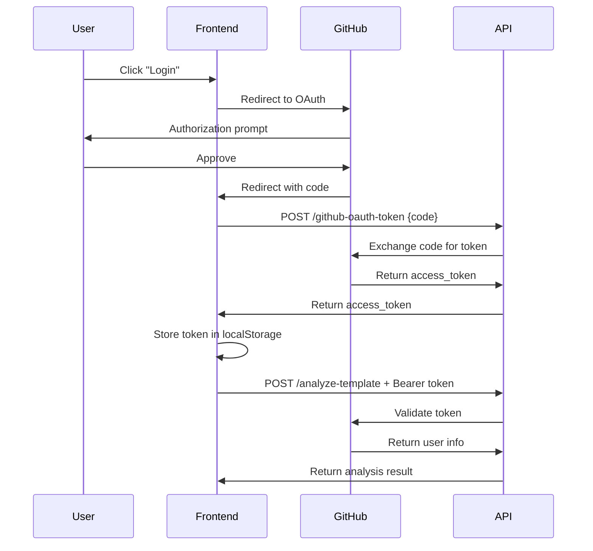

# OAuth 2.0 API Authentication

**Status**: ✅ Implemented  
**Version**: v2.1.0+  
**Last Updated**: 2025-10-19

---

## Overview

Template-Doctor API endpoints are protected using OAuth 2.0 authentication with GitHub tokens. Users must authenticate via GitHub OAuth to access protected endpoints.

### Authentication Flow



---

## Public Endpoints (No Authentication Required)

These endpoints are accessible without authentication:

| Endpoint                     | Method | Description                              |
| ---------------------------- | ------ | ---------------------------------------- |
| `/api/health`                | GET    | Health check endpoint                    |
| `/api/v4/client-settings`    | GET    | Runtime configuration for frontend       |
| `/api/v4/github-oauth-token` | POST   | OAuth token exchange (used during login) |

---

## Protected Endpoints (Authentication Required)

All other API endpoints require a valid GitHub OAuth token in the `Authorization` header.

### Template Analysis

- `POST /api/v4/analyze-template` - Analyze a template repository
- `POST /api/v4/batch-scan-start` - Start batch analysis
- `GET /api/v4/batch-scan-status/:batchId` - Get batch status

### Validation

- `POST /api/v4/validation-template` - Trigger validation workflow
- `GET /api/v4/validation-status/:runId` - Check validation status
- `POST /api/v4/validation-cancel/:runId` - Cancel validation

### GitHub Integration

- `POST /api/v4/issue-create` - Create GitHub issue
- `POST /api/v4/repo-fork` - Fork repository
- `POST /api/v4/action-trigger` - Trigger GitHub Action
- `GET /api/v4/action-run-status/:owner/:repo/:runId` - Check action status

### Analysis Management

- `POST /api/v4/add-template-pr` - Submit analysis as PR
- `POST /api/v4/archive-collection` - Archive analysis

---

## Admin Endpoints (Admin Privileges Required)

Admin endpoints require both authentication AND admin privileges (user must be in `ADMIN_GITHUB_USERS` list).

| Endpoint                    | Method | Description              |
| --------------------------- | ------ | ------------------------ |
| `/api/admin/db-info`        | GET    | Database connection info |
| `/api/admin/settings`       | GET    | Configuration settings   |
| `/api/v4/admin/config`      | GET    | Get all configuration    |
| `/api/v4/admin/config/:key` | GET    | Get specific setting     |
| `/api/v4/admin/config/:key` | PUT    | Update setting           |
| `/api/v4/admin/config/:key` | DELETE | Delete setting           |

---

## Usage

### Frontend (Browser)

The frontend automatically handles authentication:

```typescript
// User clicks login button
await GitHubAuth.login();

// After successful login, token is automatically included in API calls
const result = await TemplateAnalyzer.analyzeTemplate(
  'https://github.com/Azure-Samples/todo-nodejs-mongo',
  'dod',
);
```

### Direct API Calls (curl, Postman, etc.)

**1. Obtain a GitHub Personal Access Token**

Go to GitHub Settings → Developer settings → Personal access tokens → Generate new token

Required scopes:

- `public_repo` - Access public repositories
- `read:user` - Read user profile

**2. Make authenticated requests**

```bash
# Set your token
export GITHUB_TOKEN="ghp_your_github_personal_access_token"

# Call protected endpoint
curl -X POST http://localhost:3000/api/v4/analyze-template \
  -H "Authorization: Bearer $GITHUB_TOKEN" \
  -H "Content-Type: application/json" \
  -d '{
    "repoUrl": "https://github.com/Azure-Samples/todo-nodejs-mongo",
    "ruleSet": "dod"
  }'
```

### Programmatic Access (Node.js, Python, etc.)

**Node.js Example:**

```javascript
const axios = require('axios');

const GITHUB_TOKEN = process.env.GITHUB_TOKEN;
const API_BASE = 'http://localhost:3000';

async function analyzeTemplate(repoUrl, ruleSet = 'dod') {
  const response = await axios.post(
    `${API_BASE}/api/v4/analyze-template`,
    { repoUrl, ruleSet },
    {
      headers: {
        Authorization: `Bearer ${GITHUB_TOKEN}`,
        'Content-Type': 'application/json',
      },
    },
  );

  return response.data;
}

// Usage
analyzeTemplate('https://github.com/Azure-Samples/todo-nodejs-mongo')
  .then((result) => console.log(result))
  .catch((error) => console.error('Error:', error.response?.data));
```

**Python Example:**

```python
import requests
import os

GITHUB_TOKEN = os.environ.get('GITHUB_TOKEN')
API_BASE = 'http://localhost:3000'

def analyze_template(repo_url, rule_set='dod'):
    response = requests.post(
        f'{API_BASE}/api/v4/analyze-template',
        json={'repoUrl': repo_url, 'ruleSet': rule_set},
        headers={
            'Authorization': f'Bearer {GITHUB_TOKEN}',
            'Content-Type': 'application/json'
        }
    )
    response.raise_for_status()
    return response.json()

# Usage
result = analyze_template('https://github.com/Azure-Samples/todo-nodejs-mongo')
print(result)
```

---

## Error Responses

### 401 Unauthorized - Missing/Invalid Token

**Scenario**: No Authorization header or invalid token

```json
{
  "error": "Unauthorized",
  "message": "Missing or invalid Authorization header. Expected: Bearer <github_token>"
}
```

**Solution**: Include valid GitHub token in Authorization header

### 401 Unauthorized - Invalid GitHub Token

**Scenario**: Token validation with GitHub failed

```json
{
  "error": "Unauthorized",
  "message": "Invalid GitHub token or unable to fetch user information"
}
```

**Solution**:

- Verify token is correct
- Check token hasn't expired
- Ensure token has required scopes (`public_repo`, `read:user`)
- Generate a new token if needed

### 403 Forbidden - Insufficient Privileges

**Scenario**: Admin endpoint accessed by non-admin user

```json
{
  "error": "Forbidden",
  "message": "User 'username' does not have admin privileges",
  "hint": "Contact the system administrator to request admin access"
}
```

**Solution**: Contact administrator to be added to `ADMIN_GITHUB_USERS` list

### 503 Service Unavailable - Admin Not Configured

**Scenario**: Admin endpoint accessed but no admins configured

```json
{
  "error": "Service Unavailable",
  "message": "Admin access not configured. Please contact the system administrator."
}
```

**Solution**: Administrator must set `ADMIN_GITHUB_USERS` environment variable

---

## Configuration

### Environment Variables

**Backend (.env)**:

```bash
# Admin Users (comma-separated GitHub usernames)
ADMIN_GITHUB_USERS=username1,username2,username3

# GitHub OAuth (for frontend login)
GITHUB_CLIENT_ID=your_oauth_app_client_id
GITHUB_CLIENT_SECRET=your_oauth_app_client_secret
```

### GitHub OAuth App Setup

1. Go to GitHub Settings → Developer settings → OAuth Apps
2. Click "New OAuth App"
3. Fill in details:
   - **Application name**: Template Doctor
   - **Homepage URL**: `http://localhost:3000` (or your domain)
   - **Authorization callback URL**: `http://localhost:3000/callback.html`
4. Copy Client ID and Client Secret to `.env`

---

## Security Considerations

### Token Storage

- Frontend stores tokens in `localStorage` with key `gh_access_token`
- Tokens are sent via HTTPS in production
- Tokens are validated on every request

### Token Validation

- Backend validates tokens by calling GitHub API (`/user` endpoint)
- Invalid/expired tokens return 401 immediately
- User info is attached to `req.user` for downstream use

### Best Practices

1. **Use HTTPS in production** - Never send tokens over HTTP
2. **Rotate tokens regularly** - Generate new tokens periodically
3. **Minimal scopes** - Only request required scopes (`public_repo`, `read:user`)
4. **Never commit tokens** - Use environment variables
5. **Monitor token usage** - Check for suspicious activity

### Rate Limiting

- GitHub API has rate limits (5,000 requests/hour for authenticated users)
- Template-Doctor respects these limits
- Consider implementing additional rate limiting for your instance

---

## Troubleshooting

### "Cannot connect to backend server"

**Problem**: Frontend can't reach API  
**Solution**: Ensure Express server is running on port 3001 (or configured port)

### "Session expired. Please log in again"

**Problem**: Token expired or revoked  
**Solution**: Log out and log in again to get fresh token

### "Admin access required"

**Problem**: Trying to access admin endpoint as non-admin  
**Solution**: Contact administrator or set `ADMIN_GITHUB_USERS` environment variable

### Token validation slow

**Problem**: Every request validates token with GitHub (network call)  
**Future Enhancement**: Implement JWT tokens with caching (see roadmap)

---

## Migration from Unauthenticated API

If you were using Template-Doctor before OAuth authentication was added:

### For Frontend Users

No changes needed! The frontend handles authentication automatically.

### For API Users (scripts, CI/CD, etc.)

**Before** (no authentication):

```bash
curl -X POST http://localhost:3000/api/v4/analyze-template \
  -d '{"repoUrl":"...", "ruleSet":"dod"}'
```

**After** (with authentication):

```bash
curl -X POST http://localhost:3000/api/v4/analyze-template \
  -H "Authorization: Bearer $GITHUB_TOKEN" \
  -d '{"repoUrl":"...", "ruleSet":"dod"}'
```

---

## Roadmap

Future authentication enhancements:

- [ ] JWT tokens (reduce GitHub API calls)
- [ ] Refresh tokens (long-lived sessions)
- [ ] API keys (for programmatic access)
- [ ] Role-based access control (RBAC)
- [ ] Per-user rate limiting
- [ ] Token expiration management
- [ ] OAuth with other providers (Azure AD, etc.)

---

## Related Documentation

- [API Reference](./API_REFERENCE.md)
- [OAuth Configuration](./OAUTH_CONFIGURATION.md)
- [Architecture](./architecture.md)
- [Security](../../SECURITY.md)
